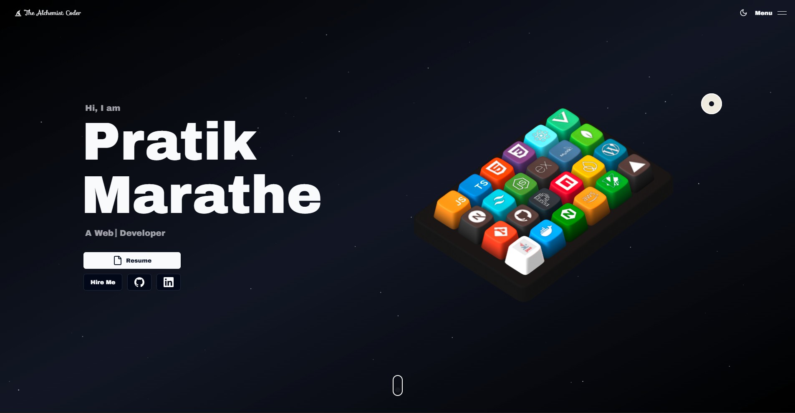

# 🚀 3D Developer Portfolio

A high-performance, interactive developer portfolio built with **Next.js 14**, featuring immersive **3D elements (Spline)**, smooth **GSAP** animations, and a modern **bento-grid** design.



## ✨ Features

- **3D Interactivity:** Integrated **Spline** scenes (3D Keyboard, Floating Objects) for a unique user experience.
- **Advanced Animations:** Powered by **GSAP ScrollTrigger** and **Framer Motion** for smooth reveal effects.
- **Modern Tech Stack:** Built with the latest **Next.js 14 (App Router)** and **TypeScript**.
- **Responsive Design:** Fully responsive layouts using **Tailwind CSS** and **Shadcn UI**.
- **Dark/Light Mode:** Themed UI with persistent state and custom transition effects.
- **Performance Optimized:** Uses **Lenis** for smooth scrolling and optimized asset loading.
- **Backend Integration:** Includes a contact form integrated with **Formspree/Resend**.

## 🛠️ Tech Stack

### Core
- **Framework:** [Next.js 14](https://nextjs.org/)
- **Language:** [TypeScript](https://www.typescriptlang.org/)
- **Styling:** [Tailwind CSS](https://tailwindcss.com/) & [Sass](https://sass-lang.com/)

### UI & Animations
- **3D Engine:** [Spline](https://spline.design/) & [Three.js](https://threejs.org/)
- **Animations:** [GSAP](https://gsap.com/) & [Framer Motion](https://www.framer.com/motion/)
- **Components:** [Shadcn UI](https://ui.shadcn.com/) & [Aceternity UI](https://ui.aceternity.com/)
- **Icons:** [Lucide React](https://lucide.dev/) & [React Icons](https://react-icons.github.io/react-icons/)

### Utilities
- **Smooth Scroll:** [Lenis](https://github.com/darkroomengineering/lenis)
- **Email:** Resend / Formspree
- **State:** React Hooks & Context

## 🚀 Getting Started

Follow these steps to run the project locally.

### Prerequisites
Make sure you have **Node.js** (v18+) installed.

### Installation

1. **Clone the repository:**
   ```bash
   git clone [https://github.com/PratikVMarathe/portfolio-ui.git](https://github.com/PratikVMarathe/portfolio-ui.git)
   cd portfolio-ui
   ```

2. **Install dependencies:**
   ```bash
   npm install
    # or
    yarn install
    # or
    pnpm install
   ```

3. **Set up Environment Variables:** Create a ```.env.local``` file in the root directory and add your keys (if using email services):
   ```bash
    NEXT_PUBLIC_RESEND_API_KEY=your_api_key_here
   ```

4. Run the development server:
   ```bash
    npm run dev
   ```
5. Open your browser: Navigate to ```http://localhost:3000``` to view the site.

## 📂 Project Structure
```bash
portfolio-ui/
├── public/              # Static assets (3D models, images, icons)
├── src/
│   ├── app/             # Next.js App Router pages
│   ├── components/      # Reusable React components
│   │   ├── ui/          # Shadcn UI primitives
│   │   ├── sections/    # Main landing page sections (Hero, About, Skills)
│   │   └── ...
│   ├── data/            # Static data (projects, skills, constants)
│   ├── hooks/           # Custom React hooks
│   └── lib/             # Utility functions
└── tailwind.config.ts   # Tailwind configuration
```

## 🤝 Contributing
Contributions are welcome! Please feel free to submit a Pull Request.

1. Fork the Project
2. Create your Feature Branch (```git checkout -b feature/AmazingFeature```)
3. Commit your Changes (```git commit -m 'Add some AmazingFeature'```)
4. Push to the Branch (```git push origin feature/AmazingFeature```)
5. Open a Pull Request

📄 License
This project is licensed under the MIT License - see the LICENSE file for details.

Star ⭐ this repo if you find it useful!
